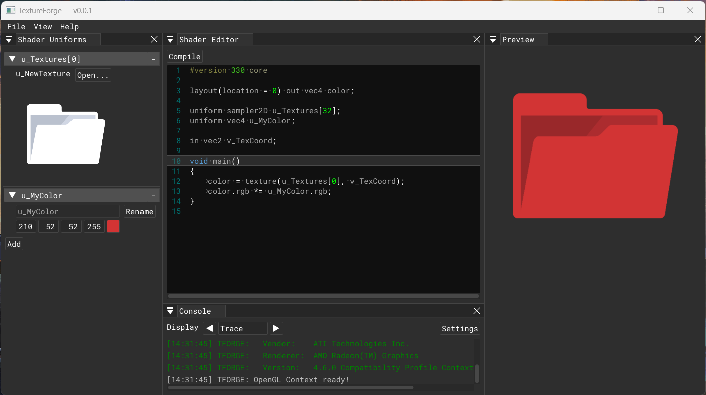

# TexWriter

> A shader-based texture generation tool.



## Motivation and Use Case

As a programmer working very closelly with artists in many different situations, plenty of times I've found myself
in the need of a quick texture edit, or wanting to generate a simple image to improve or complement an artist's
work.

Trying to avoid disrupting their workflow for a minor change in a game asset, I've given some texture generation apps
a chance, and in all occasions I've ended up opening a Paint-like, rudimentary image editor. The amount of options
and loads of spaghetti nodes resulted on me giving up, when most of the times the changes I wanted could be written
down in a shader program.

This small tool is the response to this kinda stupid tech-art struggle.


## Building TexWriter

TexWriter is designed for a Visual Studio 2019 development environment, using C++ and OpenGL.

To get a clean build of the application, we must first make a `--recursive` clone of this repository:

```bash
git clone --recursive https://github.com/pacojq/TexWriter
```

Once the source is cloned, the Visual Studio solution can be generated executing the `GenerateProjects.bat` command.


## Features

The features that TexWriter provides, ordered by implementation priority, list as follow:

- [x] Fragment shader editor
- [x] Shader compiler
- [x] Export image asset
- [ ] Editor feedback on shader compile errors
- [ ] Include input image files
- [ ] Define custom uniform variables
- [ ] Save and load TexWriter projects
- [ ] Include OpenGL files


## Dependencies and Third Party Code

TexWriter has the following dependencies:

  - [ImGui](https://github.com/ocornut/imgui) for GUI rendering.
  - [GLFW](https://github.com/glfw/glfw) for OpenGL, OpenGL ES, window creation 
  and input handling. More info at its [website](https://www.glfw.org/).
  - [Glad](https://glad.dav1d.de) for OpenGL rendering.
  - [glm](https://github.com/g-truc//glm) as math(s) library.
  - [spdlog](https://github.com/gabime/spdlog) for logging.
  - [stb_image.h](https://github.com/nothings/stb) for texture loading.
  - [pugixml](https://pugixml.org) for project serialization in XML.
  - [ImGuiColorTextEdit](https://github.com/BalazsJako/ImGuiColorTextEdit) for shader source editor.

Projects are generated with [Premake 5](https://github.com/premake/premake-core/releases).
